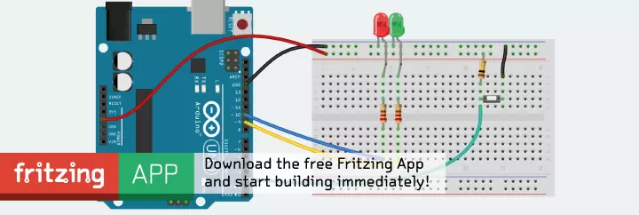
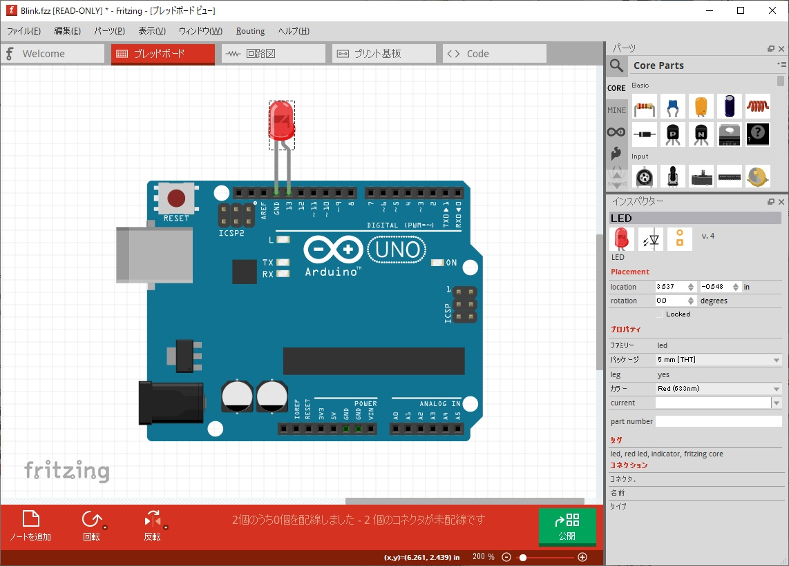

# Introduction
There are custom parts for "fritzing". Please use it freely.

## What is "fritzing"?

"fritzing" is one of the schematic design software. Before actually connecting the microcomputer and parts (such as LEDs and resistors), you can simulate the wiring arrangement.

### Below are references.
- [fritzing Official Website](https://fritzing.org/)
- [fritzing Official GitHub](https://github.com/fritzing/fritzing-app#readme)
- [fritzing Wikipedia](https://en.wikipedia.org/wiki/Fritzing)

## Why use "fritzing"?
- Even if the circuit is disassembled, it can be reproduced in a short time based on the circuit diagram.
- Design efficient wiring and avoid complicated wiring.

, and so on.

## How to use "fritzing"
The basic circuits (eg Arduino) and components (resistors, LEDs, etc.) are already included in the software.

To create a circuit, **simply drag and drop components from the parts window into workspace.**

Below is the LED blinking circuit.

## What are custom parts?
Custom parts are parts that are made by yourself. It is the latest parts and niche parts etc.

(Uploaded everywhere.)
